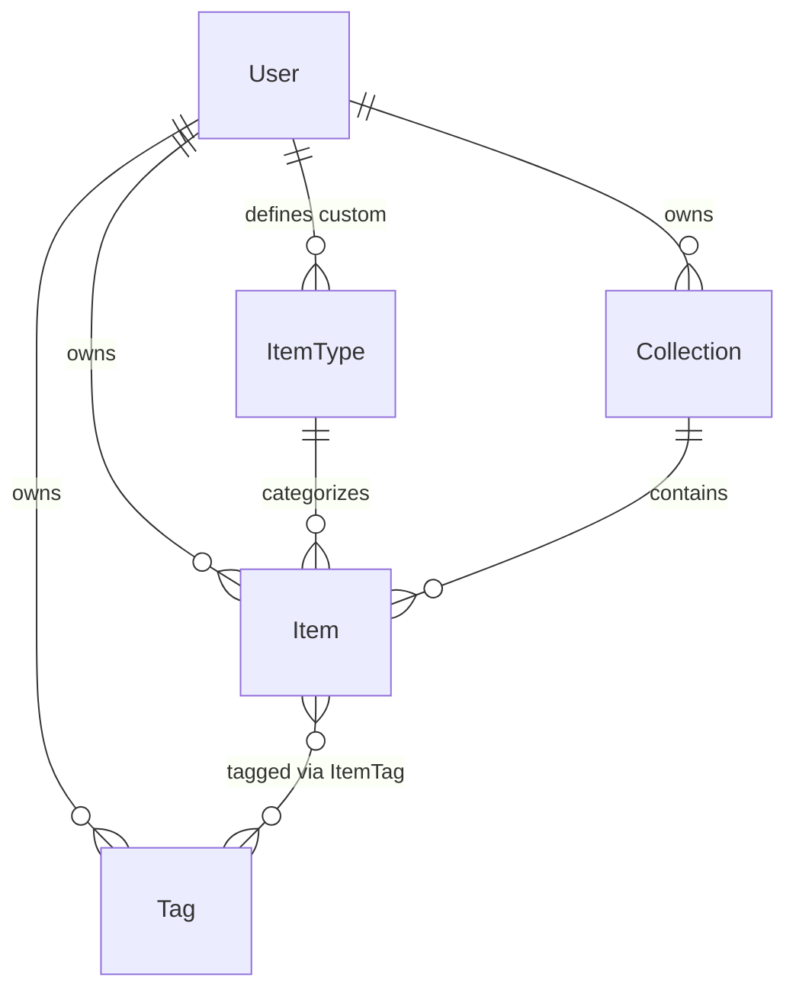
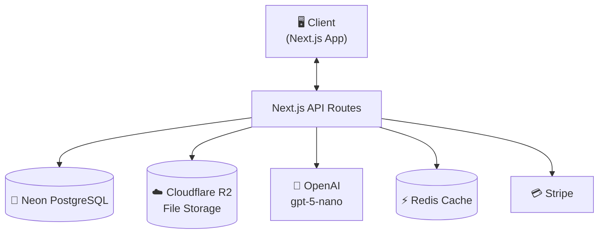
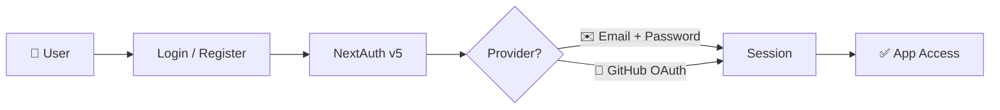
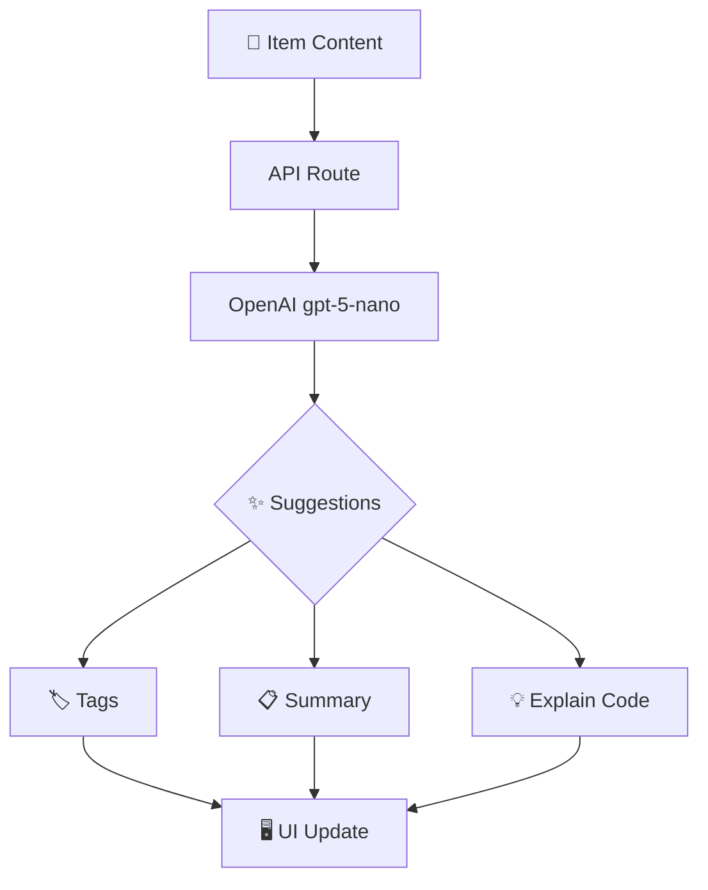

# 🧰 DevStash — Project Specifications

> **Store Smarter. Build Faster.** 🏗️
> A centralized, AI-enhanced knowledge hub for code snippets, AI prompts, docs, commands, files & more.

| | |
|---|---|
| **Status** | 🟡 In planning — ready for environment setup & UI scaffolding |
| **Stack** | Next.js · TypeScript · Prisma · Neon · Tailwind v4 · shadcn/ui |
| **AI** | OpenAI `gpt-5-nano` |
| **Billing** | Stripe (Free / Pro) |

---

## 📑 Table of Contents

1. [Problem](#-problem)
2. [Target Users](#-target-users)
3. [Core Features](#-core-features)
4. [Data Model](#️-data-model)
5. [Tech Stack](#-tech-stack)
6. [Monetization](#-monetization)
7. [UI / UX Guidelines](#-ui--ux)
8. [Architecture](#-architecture)
9. [API Surface (Proposed)]#-api-surface-proposed)
10. [Environment Variables](#-environment-variables)
11. [Development Workflow](#-development-workflow)
12. [Roadmap](#-roadmap)

---

## 📌 Problem

Developers keep their essentials scattered across tools:

| What | Where it lives today |
|---|---|
| 💻 Code snippets | VS Code, Notion, random files |
| 🤖 AI prompts | Chat histories |
| 📄 Context files | Buried inside projects |
| 🔗 Useful links | Browser bookmarks |
| 📚 Docs | Random folders |
| ⌨️ Commands | `.txt` files, bash history |
| 📦 Templates | GitHub Gists |

**The result:** context switching, lost knowledge, and inconsistent workflows.

➡️ **DevStash provides ONE searchable, AI-enhanced hub for all dev knowledge & resources.**

---

## 🧑‍💻 Target Users

| Persona | Needs |
|---|---|
| 👨‍💻 **Everyday Developer** | Quick access to snippets, commands, links |
| 🤖 **AI-First Developer** | Store prompts, workflows, context files |
| 🎓 **Content Creator / Educator** | Save course notes, reusable code |
| 🏗️ **Full-Stack Builder** | Patterns, boilerplates, API references |

---

## ✨ Core Features

### 📦 Items & System Item Types

Every item belongs to a built-in type:

| Type | Icon | Example |
|---|---|---|
| Snippet | 💻 | `useDebounce.ts` |
| Prompt | 🤖 | "Code review checklist prompt" |
| Note | 📝 | Meeting notes, learnings |
| Command | ⌨️ | `docker prune` one-liners |
| File | 📄 | Templates, configs |
| Image | 🖼️ | Screenshots, diagrams |
| URL | 🔗 | Docs, articles, tools |

> 🔓 **Pro users** can create **custom item types**.

### 🗂️ Collections

Group items into collections — **mixed item types allowed**.

Examples: `React Patterns` · `Context Files` · `Python Snippets`

### 🔍 Search

Full-text search across:

- Content
- Titles
- Tags
- Types

### 🔐 Authentication

- ✉️ Email + Password
- 🐙 GitHub OAuth

### ⭐ Additional Features

- ❤️ Favorites & 📌 pinned items
- 🕘 Recently used
- 📥 Import from files
- ✍️ Markdown editor for text items
- ⬆️ File uploads (images, docs, templates)
- 📤 Export (JSON / ZIP)
- 🌙 Dark mode (default)

### 🧠 AI Superpowers *(Pro)*

| Feature | Description |
|---|---|
| 🏷️ Auto-tagging | Suggest tags from item content |
| 📋 AI Summaries | Condense long notes/docs |
| 💡 Explain Code | Plain-English explanation of snippets |
| ✨ Prompt Optimization | Improve stored prompts |

> Powered by **OpenAI `gpt-5-nano`**.

---

## 🗄️ Data Model

### Prisma Schema (Draft)

> This schema is a starting point and will evolve during the course.

```prisma
model User {
  id                   String       @id @default(cuid())
  email                String       @unique
  password             String?
  isPro                Boolean      @default(false)
  stripeCustomerId     String?      @unique
  stripeSubscriptionId String?
  items                Item[]
  itemTypes            ItemType[]
  collections          Collection[]
  tags                 Tag[]
  createdAt            DateTime     @default(now())
  updatedAt            DateTime     @updatedAt
}

model Item {
  id           String      @id @default(cuid())
  title        String
  contentType  String      // text | file
  content      String?     // used for text types
  fileUrl      String?
  fileName     String?
  fileSize     Int?
  url          String?
  description  String?
  isFavorite   Boolean     @default(false)
  isPinned     Boolean     @default(false)
  language     String?     // for syntax highlighting
  userId       String
  user         User        @relation(fields: [userId], references: [id], onDelete: Cascade)
  typeId       String
  type         ItemType    @relation(fields: [typeId], references: [id])
  collectionId String?
  collection   Collection? @relation(fields: [collectionId], references: [id], onDelete: SetNull)
  tags         ItemTag[]
  createdAt    DateTime    @default(now())
  updatedAt    DateTime    @updatedAt

  @@index([userId])
  @@index([collectionId])
  @@index([typeId])
}

model ItemType {
  id       String  @id @default(cuid())
  name     String
  icon     String?
  color    String?
  isSystem Boolean @default(false)
  userId   String?
  user     User?   @relation(fields: [userId], references: [id], onDelete: Cascade)
  items    Item[]

  @@unique([name, userId])
}

model Collection {
  id          String   @id @default(cuid())
  name        String
  description String?
  isFavorite  Boolean  @default(false)
  userId      String
  user        User     @relation(fields: [userId], references: [id], onDelete: Cascade)
  items       Item[]
  createdAt   DateTime @default(now())
  updatedAt   DateTime @updatedAt

  @@index([userId])
}

model Tag {
  id     String    @id @default(cuid())
  name   String
  userId String
  user   User      @relation(fields: [userId], references: [id], onDelete: Cascade)
  items  ItemTag[]

  @@unique([name, userId])
  @@index([userId])
}

model ItemTag {
  itemId String
  tagId  String
  item   Item   @relation(fields: [itemId], references: [id], onDelete: Cascade)
  tag    Tag    @relation(fields: [tagId], references: [id], onDelete: Cascade)

  @@id([itemId, tagId])
  @@index([tagId])
}
```

### Entity Relationship Diagram



---

## 🧱 Tech Stack

| Category | Choice | Docs |
|---|---|---|
| Framework | Next.js (React 19) | [nextjs.org](https://nextjs.org) |
| Language | TypeScript | [typescriptlang.org](https://www.typescriptlang.org) |
| Database | Neon PostgreSQL | [neon.tech](https://neon.tech) |
| ORM | Prisma | [prisma.io](https://www.prisma.io) |
| Caching | Redis *(optional)* | [redis.io](https://redis.io) |
| File Storage | Cloudflare R2 | [R2 docs](https://developers.cloudflare.com/r2/) |
| CSS / UI | Tailwind CSS v4 + shadcn/ui | [tailwindcss.com](https://tailwindcss.com) · [ui.shadcn.com](https://ui.shadcn.com) |
| Auth | NextAuth v5 (email + GitHub) | [authjs.dev](https://authjs.dev) |
| AI | OpenAI `gpt-5-nano` | [platform.openai.com](https://platform.openai.com) |
| Payments | Stripe | [stripe.com](https://stripe.com) |
| Deployment | Vercel *(likely)* | [vercel.com](https://vercel.com) |
| Monitoring | Sentry *(later)* | [sentry.io](https://sentry.io) |

---

## 💰 Monetization

| | 🆓 Free | 💎 Pro |
|---|---|---|
| **Price** | $0 | $8/mo or $72/yr |
| **Items** | 50 | Unlimited |
| **Collections** | 3 | Unlimited |
| **Search** | ✅ Basic | ✅ Full |
| **Image uploads** | ✅ | ✅ |
| **File uploads** | ❌ | ✅ |
| **Custom item types** | ❌ | ✅ |
| **AI features** | ❌ | ✅ |
| **Export (JSON / ZIP)** | ❌ | ✅ |

- 🔁 **Stripe** handles subscriptions
- 🪝 **Webhooks** sync subscription state → `User.isPro`

---

## 🎨 UI / UX

### Principles

- 🌙 **Dark mode first**
- 🧘 Minimal, developer-friendly UI
- 🌈 Syntax highlighting for code
- 🧭 Inspired by **Notion**, **Linear**, and **Raycast**

### Layout

```
┌──────────────────────────────────────────────────────┐
│ ☰  DevStash            🔍 Search…           👤  ⚙️   │
├──────────────┬───────────────────────────────────────┤
│  Sidebar     │  Main Workspace                       │
│  ──────────  │  ┌─────┐ ┌─────┐ ┌─────┐              │
│  📌 Pinned   │  │Item │ │Item │ │Item │   grid/list  │
│  ❤️ Favorites│  └─────┘ └─────┘ └─────┘              │
│  🗂️ Coll.    │  ┌─────┐ ┌─────┐ ┌─────┐              │
│  🏷️ Tags     │  │Item │ │Item │ │Item │              │
│  🕘 Recent   │  └─────┘ └─────┘ └─────┘              │
└──────────────┴───────────────────────────────────────┘
```

- Collapsible sidebar with filters & collections
- Main grid/list workspace
- Full-screen item editor
- 📱 Responsive: mobile drawer for sidebar, touch-optimized icons & buttons

---

## 🔌 Architecture



### 🔐 Auth Flow



### 🧠 AI Feature Flow



---

## 🔌 API Surface (Proposed)

| Method | Route | Description |
|---|---|---|
| `GET/POST` | `/api/items` | List / create items |
| `GET/PATCH/DELETE` | `/api/items/:id` | Read / update / delete item |
| `POST` | `/api/items/:id/favorite` | Toggle favorite |
| `POST` | `/api/items/import` | Import from files |
| `GET/POST` | `/api/collections` | List / create collections |
| `PATCH/DELETE` | `/api/collections/:id` | Update / delete collection |
| `GET` | `/api/search?q=` | Full-text search |
| `GET/POST` | `/api/tags` | List / create tags |
| `POST` | `/api/ai/tag` | Auto-tag content |
| `POST` | `/api/ai/summarize` | Summarize content |
| `POST` | `/api/ai/explain` | Explain code |
| `POST` | `/api/ai/optimize-prompt` | Optimize a prompt |
| `POST` | `/api/upload` | Upload file → R2 |
| `POST` | `/api/export` | Export JSON / ZIP |
| `POST` | `/api/webhooks/stripe` | Stripe subscription sync |

---

## 🔑 Environment Variables

```bash
# Database
DATABASE_URL="postgresql://..."        # Neon connection string

# Auth
AUTH_SECRET=""
GITHUB_CLIENT_ID=""
GITHUB_CLIENT_SECRET=""

# AI
OPENAI_API_KEY=""

# Storage (Cloudflare R2)
R2_ACCOUNT_ID=""
R2_ACCESS_KEY_ID=""
R2_SECRET_ACCESS_KEY=""
R2_BUCKET_NAME=""

# Billing
STRIPE_SECRET_KEY=""
STRIPE_WEBHOOK_SECRET=""
NEXT_PUBLIC_STRIPE_PRICE_PRO_MONTHLY=""
NEXT_PUBLIC_STRIPE_PRICE_PRO_YEARLY=""

# App
NEXT_PUBLIC_APP_URL="http://localhost:3000"
```

---

## 🗂️ Development Workflow *(Course Format)*

- 🌿 **One branch per lesson** — students can follow along & compare

  ```bash
  git switch -c lesson-01-setup
  git switch -c lesson-02-auth
  git switch -c lesson-03-items-crud
  ```

- 🤝 Use **Cursor / Claude Code / ChatGPT** for assistance
- 📡 **Sentry** for runtime monitoring & error tracking
- ⚙️ **GitHub Actions** *(optional CI)*

---

## 🧭 Roadmap

### 🚀 MVP

- [ ] Items CRUD
- [ ] Collections
- [ ] Search
- [ ] Basic tags
- [ ] Free tier limits
- [ ] Auth (email + GitHub)

### 💎 Pro Phase

- [ ] AI features (auto-tag, summarize, explain, optimize)
- [ ] Custom item types
- [ ] File uploads (R2)
- [ ] Export (JSON / ZIP)
- [ ] Stripe billing & upgrade flow

### 🔮 Future Enhancements

- [ ] Shared collections
- [ ] Team / Org plans
- [ ] VS Code extension
- [ ] Browser extension
- [ ] Public API + CLI tool

---

## 📌 Status

> 🟡 **In planning** — ready for environment setup & UI scaffolding.

---

<p align="center">
  <strong>🏗️ DevStash — Store Smarter. Build Faster.</strong>
</p>